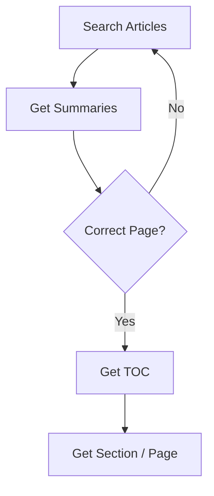

# Wikipedia MCP Server

[](https://pypi.org/project/wikipedia-mcp-server/)
[](https://opensource.org/licenses/MIT)
[](https://github.com/surendranb/wikipedia-mcp-server/actions)

This project exposes Wikipedia as an MCP server using a **Progressive Retrieval Strategy**. It is designed to minimize token usage by allowing LLMs to "scout" information before fetching large bodies of text.

## The Problem: Token Waste
Wikipedia integrations often fetch multiple full pages up front, then decide what mattered. This fills the context window with irrelevant data and increases latency and cost.

## The Solution: The Librarian Philosophy
This server implements a "Progressive Retrieval Ladder." Like a librarian helping you find a specific book, it encourages the model to:
1. **Search** for several candidate titles.
2. **Summarize** the candidates to find the right one.
3. **Inspect the TOC** to find the relevant section.
4. **Fetch** only the specific section OR the full page only if necessary.



## Tools

- `search_articles(query, limit=5)`: Top matching pages with snippets.
- `get_summaries(titles)`: Compact summaries for multiple candidate pages.
- `get_toc(title)`: Table of contents / section map for a page.
- `get_section(title, section)`: Retrieve a single section by index or title.
- `get_page(title)`: Retrieve the full plain-text page.

## Token Efficiency Benchmark
In deterministic testing, this progressive strategy achieves up to **80% token reduction** compared to naive full-page retrieval. Detailed results can be found in [BENCHMARK.md](BENCHMARK.md).

| Strategy | Token Usage (Avg) |
| :--- | :--- |
| **Naive (Full Page)** | ~100% |
| **MCP (Progressive)** | **~20%** |

## Quick Start

### Installation

From PyPI:
```bash
pip install wikipedia-mcp-server
```

For development:
```bash
git clone https://github.com/surendranb/wikipedia-mcp-server.git
cd wikipedia-mcp-server
python3 -m venv .venv
source .venv/bin/source
pip install -e .
```

### Run
```bash
wikipedia-mcp-server
```

## MCP Client Configuration

### Claude Desktop
Add this to your `claude_desktop_config.json`:

```json
{
  "mcpServers": {
    "wikipedia": {
      "command": "wikipedia-mcp-server"
    }
  }
}
```

### Cursor / VS Code
Specify the `wikipedia-mcp-server` command in your MCP settings.

## Example Prompts
- "Search for 'photosynthesis light dependent reactions' and summarize the top 3 candidates."
- "What molecules are produced during the light-dependent reactions of photosynthesis? Search first, then fetch only the relevant section."

## Development

Run tests:
```bash
python -m unittest discover -s tests -p "test_*.py" -v
```

Run benchmarks:
```bash
pip install -e ".[benchmark]"
python scripts/benchmark_token_efficiency.py
```

## Contributing
We value simplicity and surgical efficiency. If you have an improvement that maintains the single-file architecture and enhances retrieval precision, we welcome your input. See [CONTRIBUTING.md](CONTRIBUTING.md).

## License
MIT License. See [LICENSE](LICENSE) for details.
